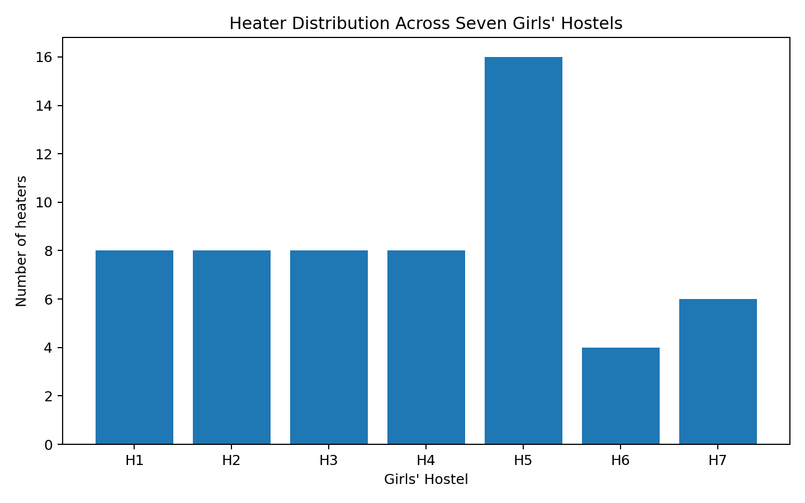
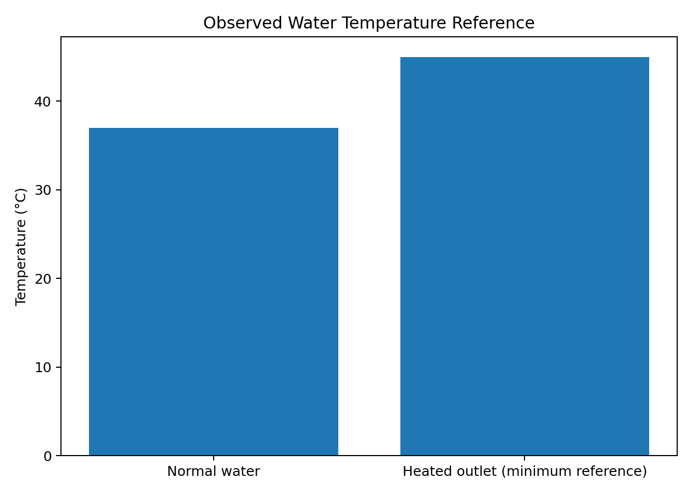
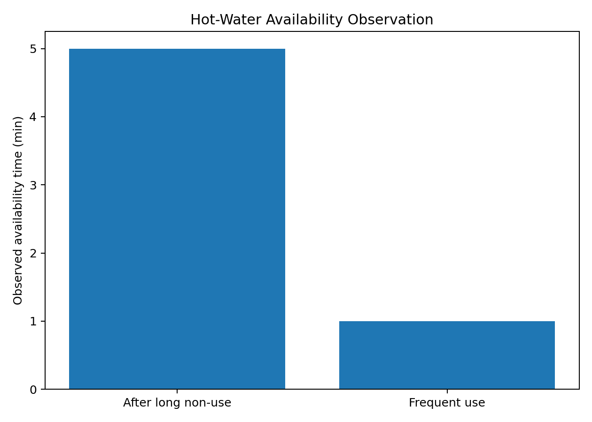
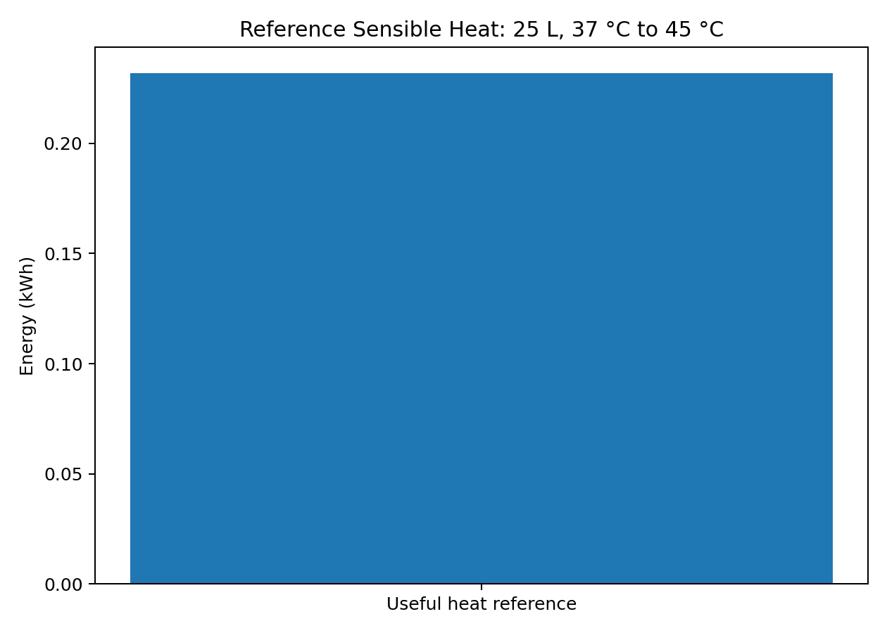

# Graphs

These graphs use only available field observations and clearly stated reference calculations.

### Heater Distribution

### Temperature Observations

### Availability Time Observations

### Reference Useful Heat

---

### Missing measurement for future graph

Collect temperature at 0, 1, 2, 3, 4 and 5 minutes (or another consistent interval) for one heater. Then create a genuine temperature-vs-time curve.
